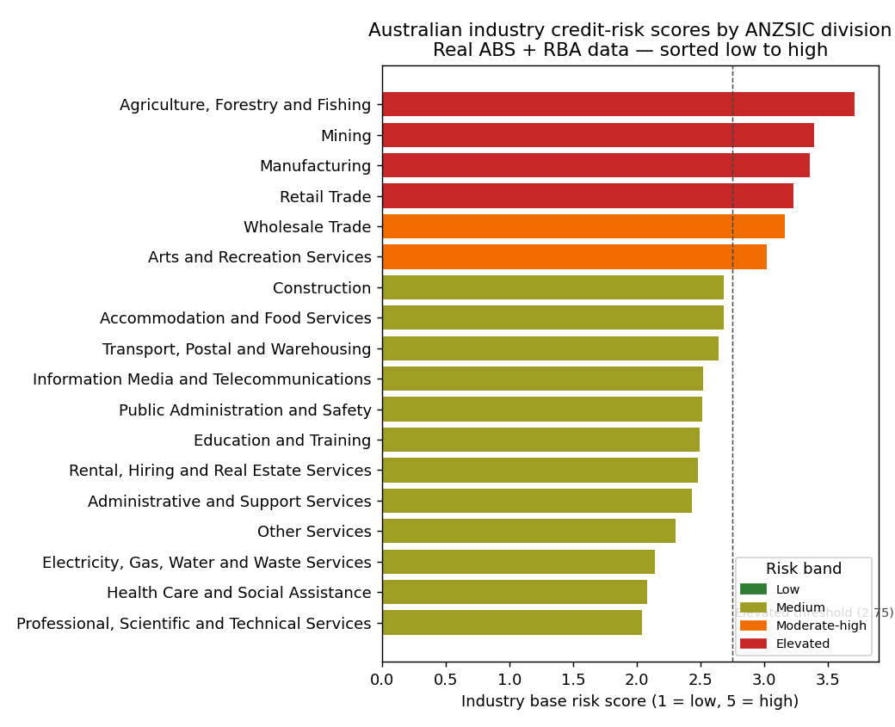
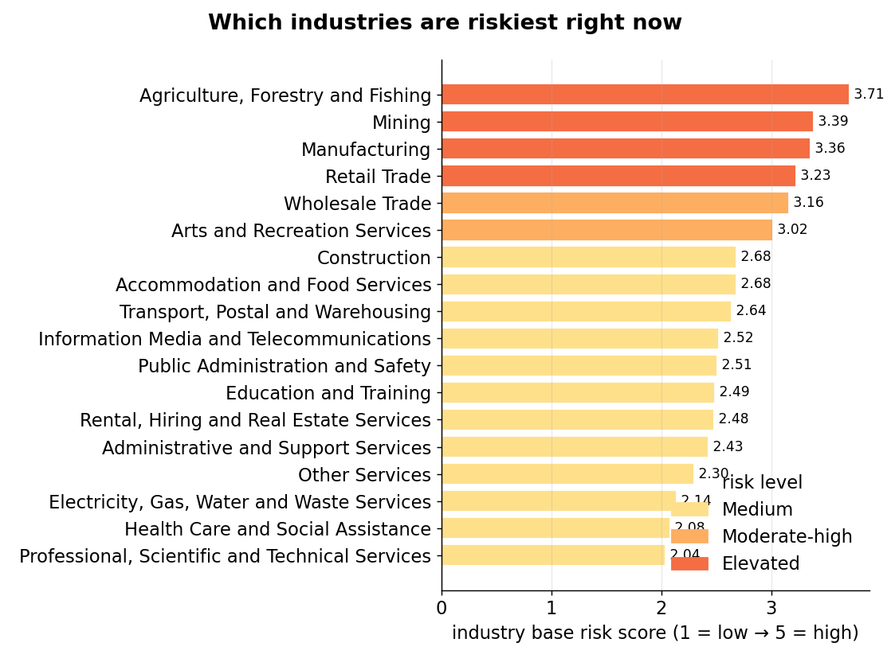
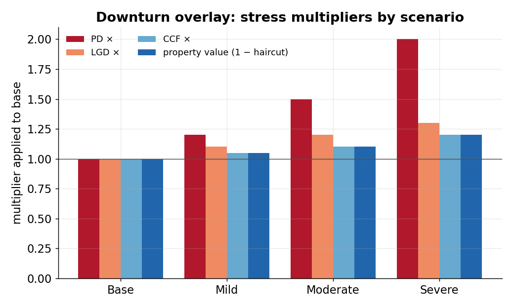
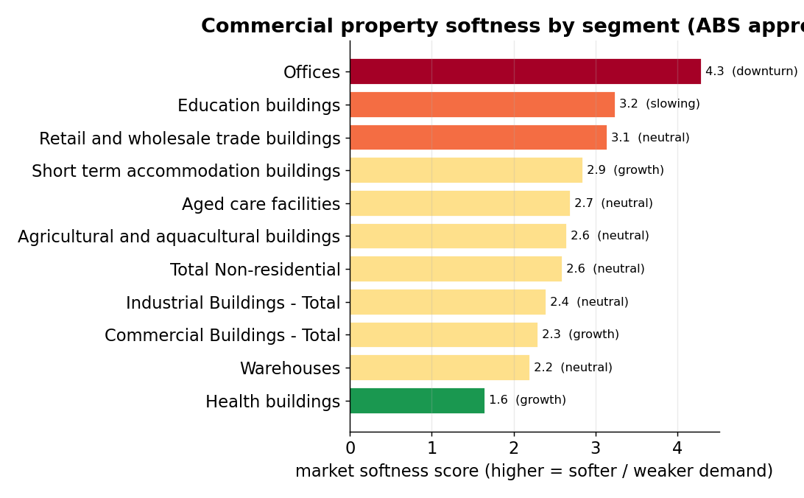
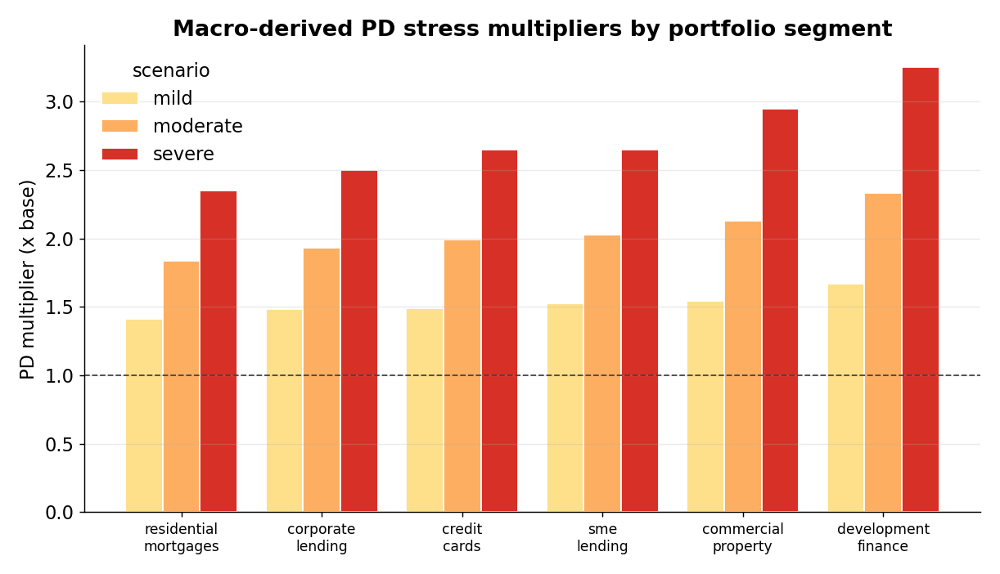
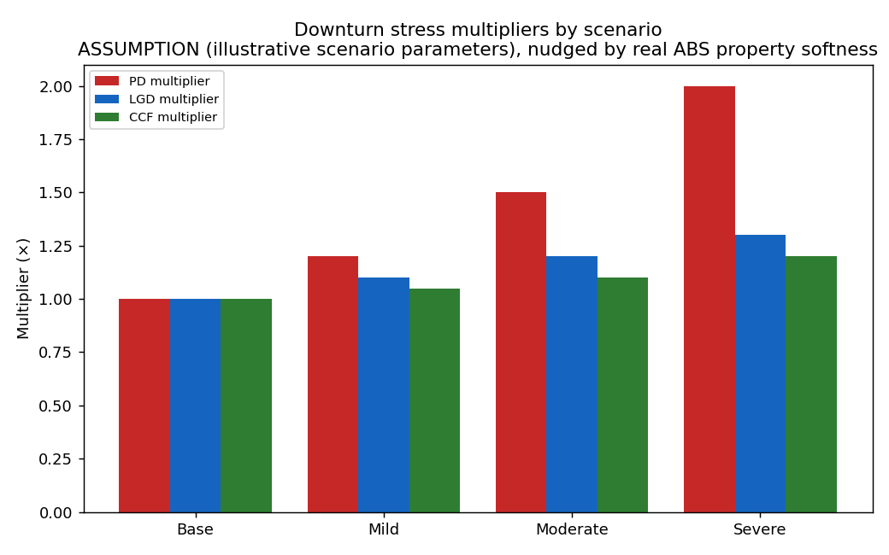

# Australian Industry & Property Risk Reference Layer

**Turns real public Australian data (ABS / RBA / PTRS) into credit-risk
overlays — industry risk scores, property-cycle signals, and downturn PD/LGD
stress multipliers — with a board-ready report.**

> **Real public data only.** This repo uses only real public sources
> (ABS, RBA, PTRS). All synthetic / staged / illustrative data has been
> removed; the only non-data inputs are clearly-labelled methodology
> *assumptions* (stress multipliers, scoring weights).

## See it in 30 seconds

- **One export:** [`outputs/contracts/industry_risk_scores.csv`](outputs/contracts/industry_risk_scores.csv) — every ANZSIC industry scored 1–5 with a PD multiplier.
- **One notebook:** [`notebooks/00_repo_overview.ipynb`](notebooks/00_repo_overview.ipynb) — the guided tour.
- **One picture:**



---

## Key charts

*All charts are regenerated from the committed contract CSVs in [outputs/contracts/](outputs/contracts/)
by [tools/make_figures.py](tools/make_figures.py) — public-source aggregated signals only.*

### 1. Which industries are riskiest right now


**What this shows:** all 18 ANZSIC industry divisions ranked by their base risk score (1 = low → 5 = high), coloured by risk band.
**Why it matters:** it instantly answers the question a credit committee asks — where in the book is the cyclical risk concentrated right now (agriculture, mining, manufacturing, retail at the top).

### 2. Downturn overlay — stress multipliers by scenario


**What this shows:** the PD, LGD and CCF multipliers (and property-value haircut) the overlay applies under base, mild, moderate and severe downturns.
**Why it matters:** these are the ready-to-use stress dials a PD/LGD/ECL model multiplies through — the bridge from "current" to "stressed" expected loss.

### 3. Where the property market is soft


**What this shows:** commercial-property segments ranked by a market-softness score built from real ABS building-approvals data, with each segment's cycle stage.
**Why it matters:** property-secured lending risk follows the building cycle — offices are in a clear downturn while other segments hold up, which should shape LGD and appetite by segment.

*Full methodology and the board/technical reports: see [notebooks/](notebooks/) and [outputs/reports/](outputs/reports/).*

---

## Why this matters for credit risk

A lender's loss rate is driven as much by *where* it lends — which industries
and property segments — as by individual borrowers. This engine reads public
data and answers three questions a credit-risk team asks every cycle, in a
form a PD/LGD/ECL model can consume directly:

- **Industry / sector risk scoring** — which of the 18 ANZSIC divisions are
  structurally or cyclically riskier right now, as a 1–5 score and a ready-to-use
  `pd_multiplier` per division.
- **Downturn / stress overlays** — base / mild / moderate / severe PD, LGD, and
  CCF multipliers plus property-value haircuts for scenario and expected-loss
  analysis.
- **Macro-cycle positioning** — where the rate and arrears cycle sits, as a
  single regime flag that conditions PD and LGD.

Everything traces back to a named public source and reporting date, and the
same inputs always produce the same outputs — the discipline a model-risk or
validation function expects.

---

## Results — current readings and industry findings

### Current macro readings

The drivers the engine conditions on, at their latest observed level (the base of every
scenario). Economy-wide drivers apply to all portfolios; industry output is the
industry-specific one. Four CRE variables have no clean free public series and are honestly
labelled assumptions.

| Macro driver | Current level | Source |
|---|---|---|
| GDP growth (real, YoY) | 1.8% | ABS 5206 National Accounts |
| Unemployment rate | 4.1% | ABS 6202 Labour Force |
| Cash rate | 4.35% (+0.5pp YoY) | RBA F1 (live) |
| Inflation (CPI, YoY) | 3.2% | ABS 6401 CPI |
| Wage growth (WPI, YoY) | 3.5% | ABS 6345 Wage Price Index |
| House-price growth (YoY) | 4.0% | ABS 6416 Residential Property Price Index |
| Exchange rate (TWI, change) | 0.0% | RBA F11 |
| Industry / sector output (YoY) | 2.0% | ABS 8155 + 5676 |
| Commercial-property prices | 0.0% | *assumption* |
| Office vacancy rate | 12.0% | *assumption* |
| CRE rents | 0.0% | *assumption* |
| CRE cap rates | 6.0% | *assumption* |

Macro regime (latest): cash-rate regime **restrictive / rising**, arrears **low / improving**,
overall macro-regime flag **base** (`macro_regime_flags.csv`).

### Industry credit-risk findings (all 18 ANZSIC divisions)

Headline: **4 industries score Elevated, 2 Moderate-high, 12 Medium** (as of 2026-06-16;
`industry_risk_scores.csv`). No industry currently sits in the Low or High band.

| Industry | Classification | Macro | Base score | Level | PD overlay |
|---|--:|--:|--:|---|--:|
| Agriculture, Forestry and Fishing | 4.12 | 3.20 | **3.71** | Elevated | 1.15× |
| Mining | 3.88 | 2.80 | **3.39** | Elevated | 1.15× |
| Manufacturing | 3.50 | 3.20 | **3.36** | Elevated | 1.15× |
| Retail Trade | 3.25 | 3.20 | **3.23** | Elevated | 1.15× |
| Wholesale Trade | 3.12 | 3.20 | 3.16 | Moderate-high | 1.10× |
| Arts and Recreation Services | 2.38 | 3.80 | 3.02 | Moderate-high | 1.10× |
| Accommodation and Food Services | 2.75 | 2.60 | 2.68 | Medium | 1.00× |
| Construction | 2.75 | 2.60 | 2.68 | Medium | 1.00× |
| Transport, Postal and Warehousing | 2.50 | 2.80 | 2.64 | Medium | 1.00× |
| Information Media and Telecommunications | 2.12 | 3.00 | 2.52 | Medium | 1.00× |
| Public Administration and Safety | 1.62 | 3.60 | 2.51 | Medium | 1.00× |
| Education and Training | 1.75 | 3.40 | 2.49 | Medium | 1.00× |
| Rental, Hiring and Real Estate Services | 2.38 | 2.60 | 2.48 | Medium | 1.00× |
| Administrative and Support Services | 2.12 | 2.80 | 2.43 | Medium | 1.00× |
| Other Services | 2.38 | 2.20 | 2.30 | Medium | 1.00× |
| Electricity, Gas, Water and Waste Services | 2.25 | 2.00 | 2.14 | Medium | 1.00× |
| Health Care and Social Assistance | 1.50 | 2.80 | 2.08 | Medium | 1.00× |
| Professional, Scientific and Technical Services | 1.75 | 2.40 | 2.04 | Medium | 1.00× |

**Industry-specific drivers behind the macro score** (the current-conditions inputs that vary
by industry; `business_cycle_panel.csv`). Demand growth is a volatile approvals/indicator proxy
(base effects), so it is read alongside employment and margins, not alone.

| Industry | Employment YoY | EBITDA margin | Demand YoY | Macro score |
|---|--:|--:|--:|--:|
| Agriculture, Forestry and Fishing | −5.1% | 14.6% | +58% | 3.20 |
| Mining | −5.1% | 47.3% | — | 2.80 |
| Manufacturing | −0.9% | 9.2% | +56% | 3.20 |
| Retail Trade | −0.5% | 7.8% | +68% | 3.20 |
| Wholesale Trade | −8.7% | 6.1% | +69% | 3.20 |
| Arts and Recreation Services | −5.8% | 13.5% | −56% | 3.80 |

Full per-industry detail (all components and source rows) is **Section 5** of the Board /
Technical report (`outputs/reports/Industry_Analysis_Q1_2026_Technical.md`).

## How the industry credit-risk score is calculated

Each industry's score blends a **structural** view with a **current-conditions** view, then maps
to a risk level and a PD overlay. The whole calculation is in
[src/panels/macro_signals.py](src/panels/macro_signals.py) (scoring) and
[src/overlays/build_industry_risk_scores.py](src/overlays/build_industry_risk_scores.py) (ladder).

**Step 1 — macro (current-conditions) score.** Five components, each scored **1 (low risk) → 5
(high risk)** from ABS business-indicator series, then averaged:

| Component | What it measures (higher risk when…) | Source |
|---|---|---|
| Employment score | industry employment YoY growth (falling) | ABS 6291 Labour Force |
| Margin level score | gross operating profit-to-sales / EBITDA margin (thin) | ABS 5676 / 8155 |
| Margin trend score | YoY change in margin (deteriorating) | ABS 5676 / 8155 |
| Inventory score | inventory days / stock-build risk (rising) | ABS 5676 |
| Demand score | demand-proxy YoY growth (weak) | ABS approvals / indicators |

`macro_risk_score = mean(employment, margin level, margin trend, inventory, demand)`

**Step 2 — blend with structural risk.** `classification_risk_score` (1–5) is the structural risk
of the ANZSIC division (cyclicality, capital intensity, revenue concentration):

`industry_base_risk_score = 0.55 × classification_risk_score + 0.45 × macro_risk_score`

**Step 3 — map to level + PD overlay** via a five-band ladder:

| Base score | Level | PD multiplier |
|---|---|--:|
| < 1.60 | Low | 0.90× |
| 1.60 – 2.00 | Moderate-low | 0.95× |
| 2.00 – 2.80 | Medium | 1.00× |
| 2.80 – 3.23 | Moderate-high | 1.10× |
| ≥ 3.23 | Elevated | 1.15× |

The PD multiplier is the deal-level industry overlay a PD model multiplies through.
**Worked example — Agriculture:** classification 4.12 (structurally cyclical, weather/commodity
exposed) and macro 3.20 → 0.55 × 4.12 + 0.45 × 3.20 = **3.71** → **Elevated** → **1.15×** PD overlay.
These are point-in-time, illustrative current-conditions overlays — not calibrated PD estimates.

## Macro stress inputs (facility + portfolio level)



A macro-driven stress layer turns a panel of macroeconomic scenario paths into **PD / LGD / EAD multipliers per portfolio segment**, then demonstrates facility-level and portfolio-level stressed expected loss on a committed demo book. Config in [config/macro_scenarios.yaml](config/macro_scenarios.yaml); engine in [src/overlays/macro_stress_core.py](src/overlays/macro_stress_core.py); full tables are **Section 9** of the Board / Technical report ([outputs/reports/Industry_Analysis_Q1_2026_Board.md](outputs/reports/Industry_Analysis_Q1_2026_Board.md)).

> Illustrative scenario design — **not** calibrated regulatory stress. Base levels are current values from the named public series; the per-scenario shocks and the portfolio elasticities are illustrative assumptions. Four CRE variables (commercial-property prices, vacancy, rents, cap rates) are labelled assumptions — no clean free quarterly public series.

**Macro variables (12).** GDP growth, unemployment, cash rate, inflation, wage growth, house-price growth, exchange rate (TWI) and industry output — anchored to ABS/RBA series; commercial-property prices, vacancy, CRE rents and CRE cap rates — labelled assumptions. Scenarios: **base / mild / moderate / severe** (mild = two consecutive quarters of ~zero GDP growth).

**Which macro drivers move which portfolio** (illustrative weights, not estimated betas):

| Portfolio | Material macro drivers |
|---|---|
| Residential mortgages | unemployment, interest (cash) rate, wage growth, house prices |
| Credit cards | unemployment, wage growth, inflation |
| SME lending | GDP, unemployment, interest rate, sector output |
| Corporate lending | GDP, sector output / revenue, interest rate, exchange rate |
| Commercial property | property values, vacancy, rents, cap rates, interest rate |
| Development finance | property prices, GDP, vacancy, interest rate |

**Two new downstream contracts** (`outputs/contracts/`): `macro_scenario_paths.csv` (scenario × variable) and `portfolio_macro_sensitivity.csv` (segment × parameter × driver). A consuming PD/LGD model applies the segment multipliers to its own facilities; here the roll-up is demonstrated on `data/raw/demo_portfolio.csv` (illustrative portfolio EL ≈ **1.9× mild, 3.2× moderate, 5.6× severe**, exposure-weighted with no diversification benefit). A bank normally builds **separate models per material portfolio** or a **pooled model with portfolio / sector effects**; this layer supplies the macro-credit linkage either approach consumes.

---

## What this produces

**Eight CSV "contracts"** in [`outputs/contracts/`](outputs/contracts/) — the
stable interface any downstream PD/LGD/ECL model reads. Live samples from the
current real-data build:

**`industry_risk_scores.csv`** — top 5 of 18 industries by risk:

| ANZSIC | Industry | Base risk score | Band | PD multiplier |
| --- | --- | --- | --- | --- |
| A | Agriculture, Forestry and Fishing | 3.71 | Elevated | 1.15 |
| B | Mining | 3.39 | Elevated | 1.15 |
| C | Manufacturing | 3.36 | Elevated | 1.15 |
| G | Retail Trade | 3.23 | Elevated | 1.15 |
| F | Wholesale Trade | 3.16 | Moderate-high | 1.10 |

**`downturn_overlay_table.csv`** — stress multipliers (methodology *assumptions*,
nudged by real ABS property softness):

| Scenario | PD × | LGD × | CCF × | Property haircut |
| --- | --- | --- | --- | --- |
| base | 1.0 | 1.0 | 1.00 | 0.00 |
| mild | 1.2 | 1.1 | 1.05 | 0.05 |
| moderate | 1.5 | 1.2 | 1.10 | 0.10 |
| severe | 2.0 | 1.3 | 1.20 | 0.20 |



**`macro_regime_flags.csv`** — current cycle position (cash-rate regime is real
RBA F1; arrears level/trend is a labelled qualitative assumption from the RBA FSR):
`cash_rate_regime = neutral_easing`, `arrears = Low / Improving`,
`macro_regime_flag = base` (as of 2026-03-16).

**`property_market_overlays.csv`** — 5 segments (4 from real ABS Cat. 8731
non-residential approvals; RES is a labelled placeholder pending ABS Cat. 8752):
CRE / RET / CON are *slowing* (softness 2.9–3.2, PD ×1.1); IND and RES *neutral*.

Plus **`industry_financial_benchmarks.csv`** (APG 220 §64 ratios per industry)
and three explainability panels (`business_cycle_panel`, `property_cycle_panel`,
`property_market_overlays_by_building_type`).

**A two-variant report** in [`outputs/reports/`](outputs/reports/) —
`Industry_Analysis_Q1_2026_Board` and `_Technical` in `.md` / `.html` / `.docx`.
The **Board** variant opens with a plain-English executive summary; the
**Technical** variant adds full source inventory, transformations, and validation.

### Not included (pending real data)

Three exports were **removed** because they could not be built from real public
data without staging additional sources. They will return — with no synthetic
fallback — once the real source is staged:

| Removed export | Real source it needs |
| --- | --- |
| `industry_failure_rates` | ASIC Series 1A insolvency statistics ÷ ABS Counts of Australian Businesses (Cat. 8165.0) |
| `property_market_detail` | ABS Residential Property Price Indexes (Cat. 6416.0 / 6432.0) + city/region series |
| `macro_context` | ABS CPI (Cat. 6401.0) and PPI (Cat. 6427.0) |

---

## What this demonstrates (for a credit-risk role)

| Area | In this project |
| --- | --- |
| **PD overlays** | Per-industry base risk scores and a `pd_multiplier` per ANZSIC division, ready to condition a PD model or scorecard. |
| **LGD / collateral** | Property-market overlays (cycle stage, softness, region risk) feeding LGD and collateral assumptions. |
| **Stress testing** | Base / mild / moderate / severe PD, LGD, CCF multipliers + property haircuts for scenario and EL analysis. |
| **APRA APG 220 grounding** | Per-industry medians of the financial ratios APG 220 §64 names as standard credit-assessment benchmarks. |
| **Australian regulatory landscape** | Works directly with ABS industry/building-approval/labour releases, the RBA cash-rate table and FSR, and the Payment Times Reporting Scheme. |
| **Data engineering & governance** | ETL from XLSX/CSV/PDF into validated CSV contracts; source inventory + lineage in every report; reproducible outputs; 124-test pytest suite; real-data-only discipline with assumptions labelled, never presented as data. |

Written in **Python** (pandas, openpyxl, pdfplumber, python-docx, matplotlib).
The skills transfer directly to SAS/SQL/R model-development and validation work.

---

## How it works

```text
   Real public sources           This engine                    Outputs
 ┌──────────────────────┐   ┌────────────────────────────┐   ┌──────────────┐
 │ ABS industry /       │   │ public_data/  load inputs   │   │ 8 CSV        │
 │   building approvals │──▶│ panels/       build panels  │──▶│ contracts    │
 │ RBA F1 cash rate,FSR │   │ overlays/     risk scores,  │   │              │
 │ Payment Times (PTRS) │   │               downturn,     │   │ Board +      │
 │                      │   │               property      │   │ Technical    │
 │                      │   │ reporting/    render report │   │ md/html/docx │
 └──────────────────────┘   └────────────────────────────┘   └──────────────┘
```

Two ideas hold the design together:

- **Every number is traceable, and assumptions are labelled.** The report
  carries a full source inventory and a transformation table. Methodology
  assumptions (stress multipliers, the qualitative arrears baseline) are marked
  `ASSUMPTION` in the data itself — never presented as observed data.
- **The same inputs always produce the same outputs.** No randomness, no hidden
  state; rerunning on the same real inputs yields identical contracts.

---

## Running it — one command

Clone, install, run. **`run_pipeline.py` auto-downloads the real public data
(ABS/RBA/PTRS); if any source is unreachable it falls back to a committed
real-data cache**, so it always produces the reports — online or offline.

```bash
python -m venv .venv
.venv\Scripts\activate                 # Windows; macOS/Linux: source .venv/bin/activate
pip install -r requirements.txt
python run_pipeline.py
```

That runs the whole flow end to end: **fetch real data (live → cache fallback)
→ build panels + overlays → export the 8 CSV contracts → validate → render the
Board + Technical report** (md / html / docx). Outputs land in `outputs/`
(contracts in `outputs/contracts/`, reports in `outputs/reports/`). The data
vintage is pinned (`DATA_AS_OF = 2026-02-28`); the committed cache and its
source attribution live in [`data/cache/`](data/cache/).

Each run prints, per source, whether it came from the **live** download or the
**cache**. To regenerate the parquet mirrors + README charts: `python src/make_readme_assets.py`.

Methodology is documented in
[`docs/methodology_cash_flow_lending.md`](docs/methodology_cash_flow_lending.md)
and
[`docs/methodology_property_backed_lending.md`](docs/methodology_property_backed_lending.md).

---

## Data sources (all real, public)

| Source | Provides |
| --- | --- |
| ABS — Australian Industry (8155.0), Business Indicators (5676.0), Labour Force (6291.0) | Industry financial ratios, activity, employment |
| ABS — Building Approvals, non-residential (8731.0) | Property-cycle and segment signals |
| RBA — F1 cash-rate table, Financial Stability Review, SMP, Chart Pack | Rate regime and stress context |
| Payment Times Reporting Scheme (PTRS) | Payment-stress signal |

---

## Repository layout

```text
industry-analysis/
├── run_pipeline.py             # ONE command: fetch -> build -> validate -> report
├── src/
│   ├── public_data/
│   │   ├── fetch_public_data.py   # Live download (ABS/RBA/PTRS) + cache fallback
│   │   └── ...                    # Loaders for the ABS/RBA inputs
│   ├── panels/                 # Business-cycle and property-cycle panels
│   ├── overlays/               # Industry risk scores, downturn + property overlays
│   ├── reporting/              # Report builder + markdown/html/docx renderers
│   ├── export_contracts.py     # Write the 8 CSV contracts
│   ├── build_board_report.py   # Render the report
│   └── make_readme_assets.py   # Parquet mirrors + README charts
├── outputs/                    # All generated artifacts
│   ├── contracts/              # The model-ready CSV contracts
│   ├── charts/                 # README / analytical chart PNGs
│   └── reports/                # Board + Technical report (md / html / docx)
├── tools/
│   └── make_figures.py         # Regenerates outputs/charts/ from the contracts
├── notebooks/                  # 00–05 guided walkthrough
├── docs/                       # Methodology notes + charts/
├── data/
│   ├── cache/                  # Committed real-data snapshot (fallback) + ATTRIBUTION
│   ├── raw/                    # Live-fetched inputs (gitignored)
│   └── processed/              # Intermediate panels
└── tests/                      # 124 tests (unit + report-render + fetch fallback)
```

---

## How this fits with my other projects

This repo is the **macro / industry / property overlay** layer of a single
commercial credit-risk stack — the upstream context a lender applies *before*
modelling individual borrowers:

| Layer | Repo | What it does |
| --- | --- | --- |
| **Macro & industry overlays** | **this repo** | ABS/RBA/PTRS → industry risk scores, property overlays, downturn stress |
| **External benchmarks** | [external-benchmark](https://github.com/Jane511/external-benchmark) | Bank & regulator Pillar 3 disclosures → PD / LGD / EAD reference points |
| **Consumer modelling** | [consumer-credit-pd-ead-scorecard](https://github.com/Jane511/consumer-credit-pd-ead-scorecard) | Borrower-level PD / EAD scorecards |
| **Mortgage modelling** | mortgage PD/LGD/EAD repo *(link pending)* | Property-backed PD / LGD / EAD |

The flow: **macro/industry overlays + external benchmarks → modelling →
validation**. This repo and `external-benchmark` are complementary — this one is
*top-down* (sector data from ABS/RBA/PTRS); `external-benchmark` is *bottom-up*
(bank/regulator disclosures). The modelling repos consume both.

---

## Scope — what it does and does not decide

The engine assembles and scores **public, sector-level** signals into reusable
overlays. It deliberately does **not** set a borrower's final PD, an
internal-portfolio LGD, a regulatory capital number, or any loan-level model —
those belong to the modelling repos that consume these overlays. Keeping that
boundary sharp — public reference data here, modelling judgement there — is what
makes the outputs trustworthy as an industry benchmark.

---

*Built by Jane Wu. Real public data only (ABS/RBA/PTRS); a sector-level
reference layer, not a firm-level credit model.*

## License

Released under the MIT License — free to read, run, and reuse with attribution.
